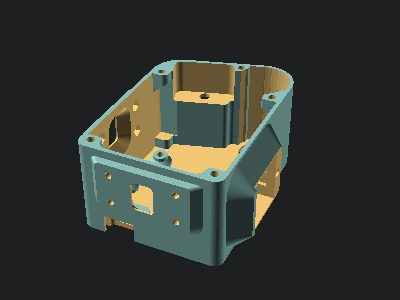

# OpenBikeSensor Case

This repository contains the 3d-printable models for OpenBikeSensor enclosures.

[Project Website](https://openbikesensor.org) |
[Model selection](https://www.openbikesensor.org/docs/hardware/general/models/) (German) |
[3D printing instructions](https://www.openbikesensor.org/docs/hardware/general/case/) (German)

If you encounter any problems or have feature requests, please open an issue on
GitHub. If you need assistance related to the contents of this repository,
please ask in the [project forums](https://forum.openbikesensor.org).


## About the files

This repository contains a lot of files for different options

* The `src/` folder contains OpenSCAD scripts for all parts. Not all parts are
  needed for printing a working enclosure. Please check the documentation
  (links on top) to assemble your custom list of parts for the variant you want
  to build.
* The `lib/` folder contains common OpenSCAD files with library functions and
  modules, as well as exports of other objects that can be imported in the part
  files, e.g. to check dimensions.
* The `variables.scad` file contains all variables used in any of the parts.
  You can customize everything by editing this file, or passing new variable
  values on the OpenSCAD command line.
* The `legacy/` folder contains old versions of the case, including lots of
  variants that were created but unmaintained. These were built with
  proprietary software packages and often available in their native format(s)
  and therefore mostly uneditable for most of the community. A lot of these
  files are also available in STEP format, and of course exported as STL for
  printing. We keep these files around for reference and convenience.

## The Standard Variant

There is a notion in the OpenBikeSensor community to label one combination of
parts and a certain version of the electronics the "Standard Model" (read about
it [here](https://www.openbikesensor.org/docs/hardware/general/models/)). This
is meant to get you started, without having to check for compatibility and
without cross referencing multiple parts of the documentation to build your own
version of the device.

To get a standard variant, print these parts:

```
MainCase/GpsAntennaLid
MainCase/MainCase
MainCase/UsbCover
MainCase/MainCaseLid
DisplayCase/DisplayCableStrainRelief (2x)
DisplayCase/DisplayCaseBottom
DisplayCase/DisplayCaseTop
Mounting/StandardMountAdapter
Mounting/SeatPostMount
Mounting/LockingPin
Mounting/HandlebarRail
```

## Compatibility

The parts are compatible with the OpenBikeSensor PCB Version `00.03.12`. Other
versions, both older and newer, might work, but are untested.

## Part list

This is a list of all available parts, and a description of what they are used for.

### MainCase/MainCase

The main case of the device enclosure. This will contain most of the
electronics. You need a matching MainCaseLid, a GpsAntennaLid, a UsbCover,
and at least one adapter for mounting the device to form a complete
enclosure.

After printing, insert the 9 threaded heatset inserts.



### MainCase/MainCaseLid

A lid for the main case. The battery is attached in here, and one of the sensor
piezos. It is held in place with five M3x8 bolts.


### MainCase/GpsAntennaLid

A small lid that covers the part of the main enclosure with the GPS antenna. It
is held in place by only one M3x8 bolt and can be removed to reveal the
antenna, behind which there is an access hole for the Micro-USB receptable of
the ESP32 dev board -- very useful for debugging or developing the firmware.


### MainCase/UsbCover

A small plug for the USB-C port on the bottom of the device, which is used for
charging the battery. This plug is held in place by 2 pairs of 3x3x3mm
neodymium magnets.


### DisplayCase/DisplayCaseTop

This part forms the display case together with DisplayCaseBottom. This contains
the I2C display and a push button and is attached to the main device with a
cable that exits through a hole in the bottom part.


### DisplayCase/DisplayCaseBottom

See `DisplayCase/DisplayCaseTop`. This part contains 3 threaded heatset inserts
and a pocket for two 20x10x1.9mm neodymium magnets. The magnets hold the
display in the rail on the handlebar (`Mounting/HandlebarRail`).


### DisplayCase/DisplayCableStrainRelief

Print two of these. They hold the display cable firmly in place inside the
`DisplayCase/DisplayCaseBottom` to prevent strain on the solder joints or
crimped connectors inside. The two halves are pushed into the hole at an angle
one by one, and then screwed together with two M3x8 bolts and hex nuts.


### Mounting/StandardMountAdapter

This part is screwed onto the main enclosure. It contains a channel for the
display cable to sit in, pressing it firmly against the outer wall of the main
case and relieving any strain from its connector inside.

This adapter is used to attach the device to the mount that is permanently
affixed to the bike. There may be different adapters in the future for
different attachment needs, but this one is the default.


### Mounting/SeatPostMount

This part gets attached to the seat post of the bicycle with zipties. Hint: A piece
of an old bicycle tube can prevent it from turning or shifting.

This is a counterpart to the `Mounting/StandardMountAdapter`, which can slide
onto this part's rail and be held in place with a `Mounting/LockingPin`.


### Mounting/LockingPin

Screw an M3x16 to M3x20 bolt through this part, such that the bolt's head sits
on the long handle's side. Now you have a pin that you can push into the hole
in the `Mounting/StandardMountAdapter` and turn 180 degrees, holding the pin,
and the device, in place.


### Mounting/HandlebarRail

Attach this part to the handlebar of your bike with two zipties or a single
hose clamp. Again, a piece from an old bicycle tube can prevent turning and shifting.

The large wall contains a pocket for two 20x10x1.9mm neodymium magnets, pushed
in one after the other. Make sure to consider their polarity to match those of
the display. The display can now slide onto this rail and is held in place by
the magnets.


