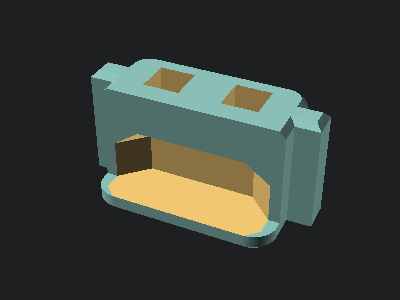
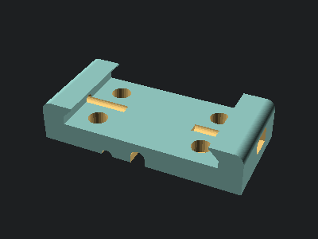
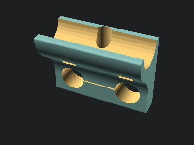
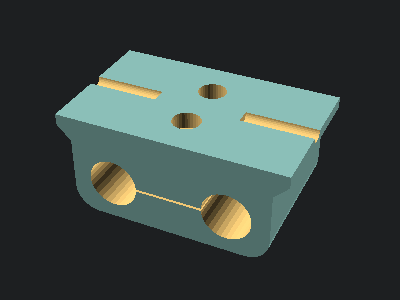

# OpenBikeSensor Case

This repository contains the 3d-printable models for OpenBikeSensor enclosures.

[Project Website](https://openbikesensor.org) |
[Model selection](https://www.openbikesensor.org/docs/hardware/general/models/) (German) |
[3D printing instructions](https://www.openbikesensor.org/docs/hardware/general/case/) (German)

If you encounter any problems or have feature requests, please open an issue on
GitHub. If you need assistance related to the contents of this repository,
please ask in the [project forums](https://forum.openbikesensor.org).


## About the files

This repository contains a lot of files for different options

* The `export/` folder contains the latest prebuilt `.stl` files for 3D printing.
  You can use those unless you want to make customizations. If you contribute
  changes to the models, you can refresh the models you changed using the 
  ``make export-all`` command.
* The `legacy/` folder contains old versions of the case, including lots of
  variants that were created but unmaintained. These were built with
  proprietary software packages and often available in their native format(s)
  and therefore mostly uneditable for most of the community. A lot of these
  files are also available in STEP format, and of course exported as STL for
  printing. We keep these files around for reference and convenience.
* The `lib/` folder contains common OpenSCAD files with library functions and
  modules, as well as exports of other objects that can be imported in the part
  files, e.g. to check dimensions.
* The `src/` folder contains OpenSCAD scripts for all parts. Not all parts are
  needed for printing a working enclosure. Please check the documentation
  (links on top) to assemble your custom list of parts for the variant you want
  to build.
* The `render/thumbnails/` folder contains rendered views of the parts. These images
  should be refreshed with changes to the parts using the `make thumbnails`
  command if you plan to submit your changes. They are used in this `README.md`.
* The `variables.scad` file contains all variables used in any of the parts.
  You can customize everything by editing this file, or passing new variable
  values on the OpenSCAD command line.

## The Standard Variant

There is a notion in the OpenBikeSensor community to label one combination of
parts and a certain version of the electronics the "Standard Model" (read about
it [here](https://www.openbikesensor.org/docs/hardware/general/models/)). This
is meant to get you started, without having to check for compatibility and
without cross referencing multiple parts of the documentation to build your own
version of the device.

To get a standard variant, print these parts:

```
MainCase/GpsAntennaLid
MainCase/MainCase
MainCase/UsbCover
MainCase/MainCaseLid
DisplayCase/DisplayCableStrainRelief (2x)
DisplayCase/DisplayCaseBottom
DisplayCase/DisplayCaseTop
Mounting/StandardMountAdapter
Mounting/SeatPostMount
Mounting/LockingPin
Mounting/HandlebarRail
```

## Compatibility

The parts are compatible with the OpenBikeSensor PCB Version `00.03.12`. Other
versions, both older and newer, might work, but are untested.

## Part list

This is a list of all available parts, and a description of what they are used for.

### Main case

The main case of the device enclosure. This will contain most of the
electronics. The core part are a `MainCase` and a `MainCaseLid`, which is
installed with five M3x8 bolts in the lid, matching the five threaded heatset
inserts in the body.

The PCB is installed into the main body with 3 heatset inserts and M3x8 bolts.
One additional heatset insert is required for the `GPSAntennaLid` (see below).
This totals 9 inserts to be placed after printing.


#### GPS antenna lid

The `GpsAntennaLid` covers the part of the main enclosure with the GPS antenna.
It is held in place by only one M3x8 bolt and can be removed to reveal the
antenna, behind which there is an access hole for the Micro-USB receptable of
the ESP32 dev board -- very useful for debugging or developing the firmware.


#### USB-C port cover

The `UsbCover` is small plug for the USB-C port on the bottom of the device,
which is used for charging the battery. This plug is held in place by 2 pairs
of 3x3x3mm neodymium magnets.



### Display case

The display case consists of two halfes, `DisplayCaseTop` and
`DisplayCaseBottom`. The display case contains the I2C display and a push
button and is attached to the main device with a cable that exits through a
hole in the bottom part.

The bottom part contains 3 threaded heatset inserts and a pocket for two
20x10x1.9mm neodymium magnets. The magnets hold the display in the rail on the
handlebar (see `HandlebarRail`).


#### Display cable strain relief

*Print two copies of this.*

The `DisplayCableStrainRelief` holds the display cable firmly in place inside
the display case to prevent strain on the solder joints or crimped connectors
inside. The two halves are pushed into the hole at an angle one after the
other, and then screwed together with two M3x8 bolts and hex nuts.


### Mounting

#### Standard mount adapter

The `StandardMountAdapter` is screwed onto the main enclosure. It contains a
channel for the display cable to sit in, pressing it firmly against the outer
wall of the main case and relieving any strain from its connector inside.

This adapter is used to attach the device to the mount that is permanently
affixed to the bike. There may be different adapters in the future for
different attachment needs, but this one is the default.



#### Seat post mount

The `SeatPostMount` gets attached to the seat post of the bicycle with zipties.

*Hint: A piece of an old bicycle tube can prevent it from turning or shifting.*

This is a counterpart to the `StandardMountAdapter`, which can slide onto this
part's rail and be held in place with a `LockingPin`.


#### Locking pin

Screw an M3x16 to M3x20 bolt through the `LockingPin` part, such that the
bolt's head sits on the long handle's side. Now you have a pin that you can
push into the hole in the `StandardMountAdapter` and turn 180 degrees, holding
the pin, and the device, in place.


#### Handlebar rail

Attach the `HandlebarRail` to the handlebar of your bike with two zipties or a single
hose clamp. Again, a piece from an old bicycle tube can prevent turning and shifting.

The large wall contains a pocket for two 20x10x1.9mm neodymium magnets, pushed
in one after the other. Make sure to consider their polarity to match those of
the display. The display can now slide onto this rail and is held in place by
the magnets.


#### Bike rack mount

The bike rack mount can be used to attach a "Top Rider" main case to a standard
bicycle rack. It consists of two parts, the `BikeRackMountSide` (which is
required twice) and `BikeRackMountCenter` or `BikeRackMountCenterLongitudinal`.

The side parts are mounted on the longitudinal rails of the rack, either above
or hanging below. They are connected with two rods (aluminium or wood) that
form cross beams, cut to sized depending on the width of the bike rack. In the
center of these rods sits the center piece, which has the attachment rail for
the sensor.

In a rotated version, the rods are aligned longitudinally, a difference center
piece (`BikeRackMountCenterLongitudinal`, third image) is used to rotate the
OBS correctly. Use this if you need your bike rack's longitudinal tubes for
attaching cargo, and you want to mount the OBS on the cross beams of the rack.

The rods can be affixed to the 3D printed parts by gluing them in place, once
they have been sized and fitted to your rack.






#### Attachment cover

If you have a main case that has both attachment points (top rider and back
rider), you may want to cover the one of them that you are not using, such that
the screw holes and (optional) cable hole are not left open. The
`AttachmentCover` is a simple cover that fits the screw pattern.


### Customization options

There are tons of variables in the `variables.scad` file, mostly dimensions,
which can be adjusted to suit your needs. Some of these variables are however
not necessarily wise to be changed, as other dimensions might inadvertently
depend on them, or they might produce invalid results in certain ranges.

However, some options are meant to be changed to suit your specific needs. The
defaults get you most of the way, but certainly, some users will need a
different set of features, so here is a list of options you might want to
change:

#### Print settings

Some options exist to control sizes and features that have been added just for
3D printing ease. Configure these to match your printing setup. The defaults
should work for most printers, but if you modify your settings greatly (e. g.
to print faster), you might also need to change these model parameters:

```
extrude_width
enable_easy_print
layer_height
default_clearance
```

#### Top Rider vs. Back Rider

A "top rider" variant main case has an attachment port on the bottom (when
mounted), while a "back rider" has it on the front. The "tranditional" OBS case
therefore is a back rider variant, as it used to always sit behind the seat
post, attached horizontally. However, many cyclists configure their bikes in a
way that there is not enough room for a whole OBS below the seat, so a
different way of attaching the OBS is needed.

Top riders can sit on the top tube, the luggage rack, or anywhere else where
there is support from below. Moving the attachment point on the main case makes
it simple to design compatible mounts with their rail on top, without a
complicated structure that "goes up and around" to provide a backwards-facing
rail.

A single case can have both top rider and back rider attachment ports. They
don't necessarily need to have an adapter attached, though it is recommended to
do so in order to fill the screw and cable holes.

To configure whether to generate top and/or back riders, set the following
variables. The `_cable` variables control whether the corresponding attachment port (if it exists) has a hole for the cable or not.

```
MainCase_back_rider
MainCase_top_rider
MainCase_back_rider_cable
MainCase_top_rider_cable
```

#### Dimensions

* General
  * `ScrewHole_diameter_M3`: A hole for an M3 bolt has this diameter. Usually,
    the bolt is not meant to grab this hole, but slide into and out of it. For
    (almost) each bolt, there is a corresponding threaded metal part (nut or
    insert), so increase this value if your bolts are hard to get where they
    need to go.
* `SeatPostMount`
  * `SeatPostMount_angle`: Set to the angle that your seat post is away from
    the vertical in degrees (usually around 20). This ensures that the device
    will sit horizontally behind the seat post.
  * `SeatPostMount_diameter`: Set to the diameter of your seat post (in mm).
    The default for most bicycles today is 28.
  * `SeatPostMount_angled_spacing`: Increase this to lengthen the mount,
    shifting the device further backwards on your bike. You might consider
    angular force, so don't set it too high, but this can help if your mount is
    hard to reach, or if the device disappears underneath your seat,
    potentially blocking GPS signal.
* `HandlebarRail`
  * `HandlebarRail_tube_radius`: The radius (half diameter) of your handlebar,
    in mm.